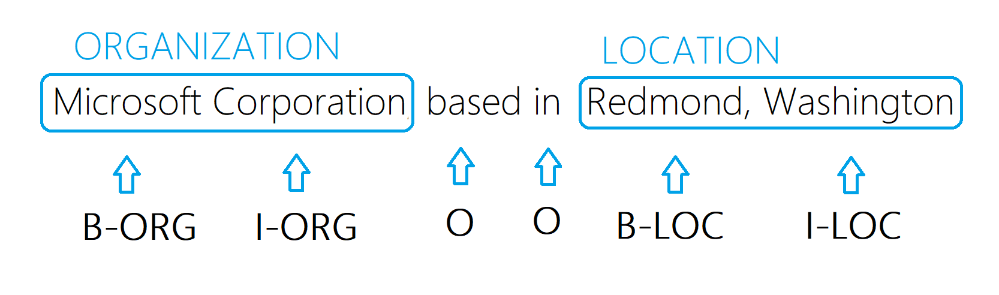
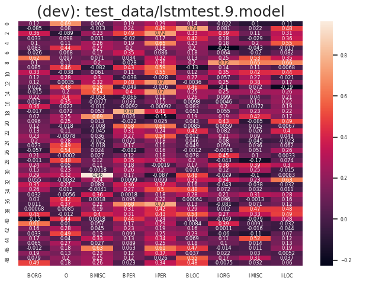
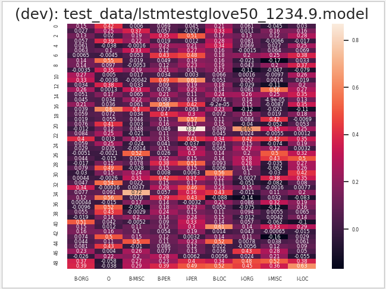
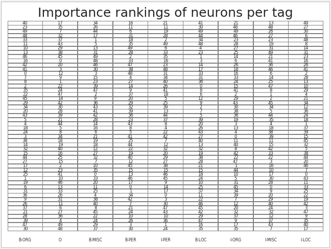
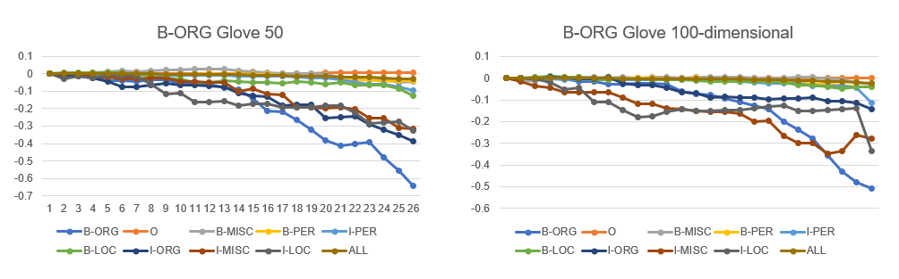
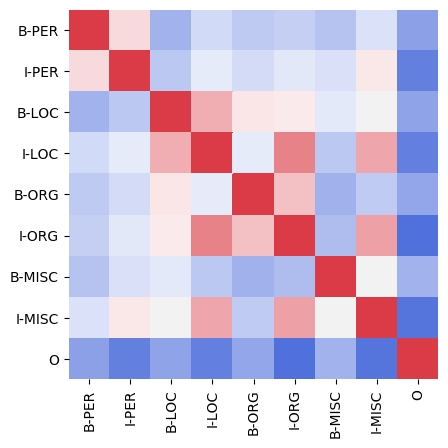
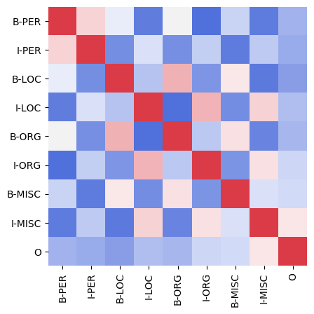
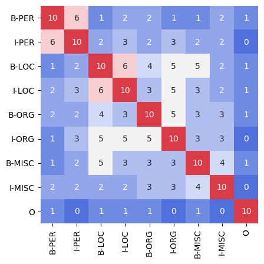
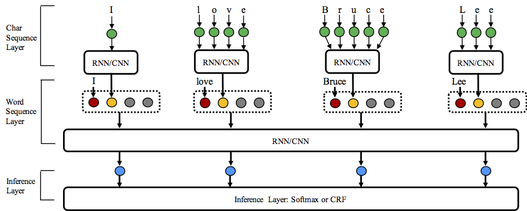

# Which neurons do NER?

> **Video Presentation** at [https://vimeo.com/492752758](https://vimeo.com/492752758)

This project demonstrates how to train an LSTM to do a simple named entity recognition (NER) task, 
with the goal of understanding which neurons are used for different parts of the task.
The task applies BIO (beginning, inside, and outside) tokens to label words that are part of entities in these categories:
person, location, organization, and miscellaneous. 

The dataset uses the following tags to label each word in a corpus:
| Tag | Description |
| ----| ----------- |
| B-PER | Beginning of a person  |
| I-PER | Inside a person's name (not the first word) |
| B-ORG | Begin an organization name |
| I-ORG | Inside an organization name |
| B-LOC | Begin a location |
| I-LOC | Inside a location name |
| B-MISC | Begin a miscellaneous name |
| I-MISC | Inside a miscellaneous name |

To determine which neurons are important for each of the tags, 
you can systematically ablate them one by one and measure the reduction in performance. The neurons that degrade the performance the most for a tag, when ablated, are the most important.
 

This project was inspired by, and builds on results from the following paper:

> Xin, J., Lin, J., & Yu, Y. (2019, November). What Part of the Neural Network Does This? Understanding LSTMs by Measuring and Dissecting Neurons. In Proceedings of the 2019 Conference on Empirical Methods in Natural Language Processing and the 9th International Joint Conference on Natural Language Processing (EMNLP-IJCNLP) (pp. 5827-5834).

* [1. About the project](#About_the_project)
* [2. Process](#Process)
* [3. Findings](#Findings)

# About the project
We started with an existing framework for doing NER, and added code for modifying the architecture, 
calculating sensitivity, importance rankings, accuracies, ablating neurons, correlations, similarity, overlap,
as well as preprocessing the dataset.

The NCRF++ framework we built on is described in a [ACL 2018 demo paper](https://arxiv.org/abs/1806.05626) 
as demonstration paper. 

We varied parameter and structure combinations on three levels: character sequence representation, word 
sequence representation and inference layer.

* Character sequence representation: character LSTM, character GRU, character CNN and handcrafted word features.
* Word sequence representation: word LSTM, word GRU, word CNN.
* Inference layer: Softmax, CRF.

### Baseline performance
We started out with this baseline performance, after setting up the experiment using the setup described in this [paper by Yang et.al.](https://arxiv.org/abs/1806.04470).
The [Process](#Process) and [Findings](#Findings) sections describes the results of systematically ablating neurons to find which ones are correlated with the identification of 
different types of entity labels.

> Note:
> We're still finalizing our experimental results so some of our numbers may end up slightly different than these in the final version.
>
| Model | Nochar | CharLSTM |CharCNN   
|--------- | --- | --- | ------    
| WordLSTM | 86.46 | 89.88 | 89.74  
| WordLSTM+CRF | 87.82 | **90.20** | **90.33** 
| WordCNN |  86.33| 90.42 | 88.39  
| WordCNN+CRF |  86.67 | 89.75 | 89.42  

## Process

* [1. Train](#Train-and-test)
* [2. Sensitivities](#Sensitivities)
* [3. Importance Rankings](#Importance-Rankings)
* [4. Accuracies](#Accuracies)
* [5. Ablating neurons](#Ablating-neurons)
* [6. Correlations](#Correlations)
* [7. Similarity](#Similarity)
* [8. Overlap](#Overlap)
* [9. Preprocessing](#preprocessing)

## Train and test
> **Note:** A prerequisite for training the model is the GloVe embeddings. You need to get them from
> https://nlp.stanford.edu/projects/glove/ and put `glove.6B.zip` in the directory `test_data`. Then you can set
> `word_emb_dir` in `test.train.config` to point to `test_data/glove.6B.zip/glove.6B.50d.txt` to use 50-dimensional embeddings, or 
> `test_data/glove.6B.zip/glove.6B.100d.txt` to use 100-dimensional embeddings.

**Train**: Training the model from the paper takes about 10 minutes. To train a model, edit a config file (an example is test.train.config), so that `model_dir` indicating the path and beginning of the filename to where you want to save your trained model. For example, `model_dir=test_data/lstmtest50` will save the model in the file `test_data/lstmtest50.9.model` (the 9 is for the 10th epoch of training starting at index 0 so that's why it's 9 and not 10). The config file consumes some preprocessed data we put in the `test_data` directory.

Then run:
> python3 main.py --config test.train.config 

**Test**: To run some of the evaluations that get data for our charts, run (change --pretrainedmodelpath to match what you set in the config file, plus ".9.model".:
> python3 main.py --config test.train.config --loadtotest True --pretrainedmodelpath "test_data/lstmtest50.9.model" --ablate 0

## Sensitivities
**Sensitivity heatmap** is generated in the `/test_data` directory (or whereever you specified in the config file) and has a name like `lstmtest50.9.model_heatmap.png`. There's also a `lstmtest50.9.model_heatmap.npy` used to calculate correlations between models. Here is a sensitivity heatmap for 50 neurons and nine BIO labels. It was generated in `heatmap_sensitivity()` in `main.py`.

If you change the random seed (find `seed_num = 42` in `main.py`, change it and train another model), you'll get a different heatmap. Here's the heatmap for a model with the same parameters but a different random seed as the previous one:
Notice that it's different, and the range of values may be different. But there are some similarities too.

## Importance rankings
**Importance rankings** for neurons are generated in files `ImportanceRankings.png`, `Importance.txt`, `Importance.tsv`, and `imps.npy`. The last one is used to calculate [*overlap*](#overlap). 
Using the sensitivity matrix shown in the heatmap, we determine the importance ranking of the each neuron and list them from most to least important. Here an example of the `ImportanceRankings.png`.

## Accuracies
**Accuracies** To save accuracies to files or show accuracies in the console output, set the parameters in the following functions to **True**.
    def get_per_tag_accuracy(expected_tag_counts, actual_tag_counts, sort=False, data=None,
        write_file=False, print_accs=False)
	
Accuracies are written to files in the root directory with names like `TAGn_acc.txt` for accuracy when you ablate n neurons. 

We also generate charts similar to one below. An example command line with the `--ablate` argument to generate charts of ablating 10 neurons of each of the tags:
`python main.py --config test.train.glove50.config --loadtotest True --pretrainedmodelpath "test_data/lstmtestgloveB50.9.model" --ablate 10`

 
The chart shows how accuracy degrades over when you ablate important neurons. Our automatically generated charts are saved in the root directory with names like `B-ORG_chart.png`.

The axes of the heatmaps list the NER tags that the model was trying to label. The accuracy rates for each tag vary, for example they might look like:

	B-LOC	0.9069134458356015
	B-MISC	0.702819956616052
	B-ORG	0.7225950782997763
	B-PER	0.9310532030401737
	I-LOC	0.669260700389105
	I-MISC	0.5549132947976878
	I-ORG	0.6125166444740346
	I-PER	0.9563886763580719
	O	0.995927770279704

## Ablating neurons
**Ablating neurons** The `--ablate` flag specifies how many neurons to ablate. You get the list of neurons to ablate from the importance ranking files or the console output, for a specified tag like B-ORG or I-MISC. Paste this list into `forward()` in `wordsequence.py` where we have a comment about `"Ablation of neurons"` for the value of `feature order`, and then run a command like the following which specifies that you want to ablate the top ten neurons.

> python3 main.py --config test.train.config --loadtotest True --pretrainedmodelpath "test_data/lstmtest50.9.model" --ablate 10

## Correlations
To calculate the correlations between the neuron sensitivitities for models with different random seeds, you can use the code in `utils/corr.py` or in `correlation_plotting.ipynb`. This will save the correlation heatmap to '/test_data/lstmtestglove50.9.model_sensitivities_correlation.png'. You can change that path to whereever you saved the trained model. The following image is the sensitivity correlation matrix for one of the models we tested:

We describe what the correlations show in [Findings](#Findings).

## Similarity
In an experiment beyond what the paper did, we measure the cosine similarity between learned weights for a pair of labels in the fully-connected layer of the model to see if there's correlation between models with different random seeds and with ablation patterns. The code for this is in `utils/weight-similarity.py`. The weights this function uses are saved in `weights.npy` after you train the model.

## Overlap
In an experiment beyond what the paper did, we measure the shared neurons in the top-ten most-important neurons of a pair of labels in the model to see if there's correlation between models with different random seeds and with ablation patterns. The code for this is in `overlap()` in `utils/weight-similarity.py`. An example of the values for different pairs of labels is shown here in the `Importance_overlap_top_ten.png` file that we generate:

## Preprocessing additional datasets
The preprocessing code in `preprocessing.ipynb` could be used for additional datasets. We processed some additional datasets which are in subfolders of the `data` directory. Our future plans include running experiments on these datasets.

# Findings
We observe the following results for **sensitivity** correlation that are consistent with the original paper:
* Label pairs of the form B-x and I-x (where x
is PER/LOC/ORG/MISC) are generally positively
correlated. We can observe some darkred
2 2 blocks on the diagonal. Although for
each trained model, it might be different neurons
(i.e., neuron #) that encode information
about B-x, these neurons typically also carry
information about I-x.
* The label triples I-LOC, I-ORG, and I-MISC
are also positively correlated.
* Label pairs of the form B-x and I-y (where
x and y are different entities) are generally
negatively correlated.
* The label O is negatively correlated with all
I-x labels.

We observe the following results for **similarity** between labels based on the vector of learned weights in the fully-connected layer:
* Label pairs of the form B-x and I-x (where x
is PER/LOC/ORG/MISC) are **not** the most similar. 
* The label triples I-LOC, I-ORG, and I-MISC
are similar.
* Labels of the form B-x are more similar to labels B-y than to label I-x (where
x and y are different entities), except in the case of B-PER and I-PER, which are similar.
* The label O is dissimilar to most labels but the closest to I-MISC.

# Notes on usage

NCRF++ supports designing the neural network structure through a configuration file. 
The program can run in two states; ***training*** and ***decoding***. (sample configuration and data have been included in this repository)  

In ***training*** status:
`python main.py --config demo.train.config`

In ***decoding*** status:
`python main.py --config demo.decode.config`

The configuration file controls the network structure, I/O, training setting and hyperparameters, and specifies whether to use CNN/LSTM/GRU. 

NCRF++ is designed in three layers (shown below): character sequence layer; word sequence layer and inference layer, as shown in this 
image from the NCRF++ documentation.

